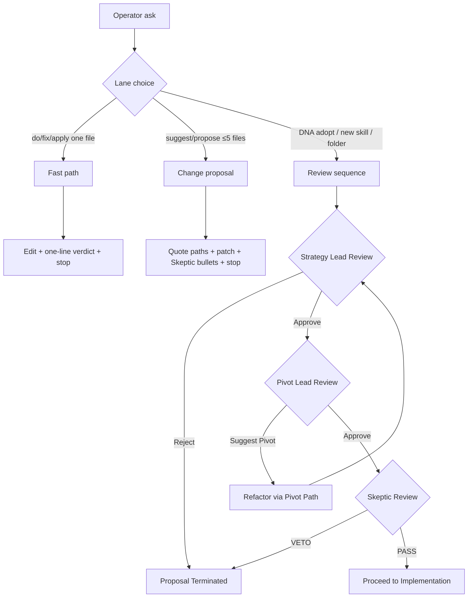

# Implementation: Stratification Review Workflow

## Fast path (MUST)

Routine local edits (one file, no new skill, no DNA change) MUST use this path and MUST NOT run the Review sequence:

1. Edit the file.
2. Write a one-line verdict.
3. Stop.

**Routing:** When the operator said do/fix/apply (not suggest/propose), Fast path MUST win unless DNA / new skill / new folder applies.

## Change proposal (MUST)

When the operator asks to **suggest** or **propose** changes (not apply), and the target is at most five files that exist in the snapshot or on disk in the attached workspace, with no new skill, no DNA adoption, and no new folder:

1. Quote existing file paths.
2. List concrete edits as a **suggested patch** ready to **copy-paste into an agent working on the private operator source** (SkillStack2).
3. Apply Skeptic lenses as bullets only: Necessity, Placement, Depth.
4. Stop.

**Suggest-only handoff:** This lane offers a paste for that SkillStack2 agent. MUST NOT open a pull request. MUST NOT edit this snapshot (or any attached clone) directly. MUST NOT write `strategy-record`, `pivot-record`, or `veto-record`. MUST NOT run the Review sequence.

DNA suggestions (including this file) are allowed as patches only; **applying** DNA requires Review sequence (`-mod`).

If a quoted path is not in the snapshot and not on disk in the workspace: stop (missing-hop). Do not invent the file or hop.

More than five files: use Review sequence.

## Overview

Three **lanes** exist: Fast path, Change proposal, and Review sequence. **Lane lock** (below) is a rule heading, not a fourth lane.

The Stratification Review is the governance loop for architecture and new-skill proposals. Fast path has equal force and MUST win for routine do/fix/apply edits. Change proposal covers bounded suggestions. Review sequence is the adopt path. Members are manifests, not runtime agents. Each Review sequence stage MUST write a named artifact (`strategy-record`, `pivot-record`, or `veto-record`). Roleplay without an artifact does not count.

## Review sequence (MUST)

1. **Stage 1: Strategy Lead (Alignment)**
   - **Goal**: Ensure the proposal aligns with the North Star.
   - **Status**: If the Strategy Lead rejects the proposal, the process terminates. If they approve, it proceeds to the Pivot Lead.

2. **Stage 2: Pivot Lead (Leverage)**
   - **Goal**: Optimize for the highest leverage (Value/Complexity).
   - **Status**: If the Pivot Lead identifies a more efficient way to achieve the goal, they suggest a "Pivot." The team may choose to adopt the pivot or proceed with the original plan. If they approve or suggest a pivot, it proceeds to the Skeptic.

3. **Stage 3: Skeptic (Complexity Control)**
   - **Goal**: Prevent bloat and unnecessary architectural depth.
   - **Status**: The Skeptic applies the "Three Lenses" (Necessity, Placement, Depth).
   - **The Veto**: If the Skeptic issues a **VETO**, the proposal is sent back to the beginning for refactoring or total rejection.

## Lane lock (MUST)

Only **Fast path**, **Change proposal**, and **Review sequence** are lanes. This heading is a closed-lane rule, not a lane.

Debug loops, escalate-difficulty procedures, and any other unnamed procedure MUST NOT run as a lane. Same force as missing-hop: stop; do not invent.

To **suggest** a new lane: Change proposal targeting `workflow.md` (suggest-only). To **adopt** a new lane: Review sequence (`-mod`).

A name that is not a lane-defining heading in this file is not a lane.

## Amendment Protocol (Board Governance)

When a change to a Board Persona or the Governance Workflow itself is proposed, the following checklist must be completed:

### 1. Impact Assessment

- [ ] **North Star Check**: Does this change strengthen or dilute the core mission?
- [ ] **Lens Integrity**: Does this change weaken one of the three lenses (Necessity, Placement, Depth)?
- [ ] **Automation Check**: Can this new rule be operationalized into an existing Core Operation/Skill?

### 2. Regression Strategy

- [ ] **Scenario Test**: Provide the new persona/rule with the existing "Golden Datasets."
- [ ] **Veto Verification**: Ensure the new rule doesn't cause "unjustified vetoes" of valid proposals.

### 3. Traceability

- [ ] **Log Entry**: Write a dated amendment record in the working tree. MUST NOT invent a log file that is not in this snapshot.
- [ ] **Task Link**: Name the operator task or issue. MUST NOT invent a `plan.md` that is not in this snapshot.

## Workflow Logic (Pseudocode)

## Governance Rules

- **Fast path supremacy**: Routine local edits (do/fix/apply) MUST skip the Review sequence.
- **Change proposal routing**: suggest/propose → Change proposal (paste for a SkillStack2 agent; no PR; no direct edit; ≤5 files).
- **Routing tie-break**: suggest/propose → Change proposal; do/fix/apply → Fast path; DNA / new skill / new folder → Review sequence regardless of wording.
- **Mandatory Sequence**: An architecture proposal cannot skip a Review sequence stage.
- **Veto Supremacy**: A Skeptic veto-record is final for the current version of the proposal.
- **Documentation**: Each Review sequence stage MUST be a named artifact in the working tree, not a persona monologue.
- **Lane lock**: Unnamed lanes are not in this snapshot. Stop or suggest via Change proposal to `workflow.md`.
