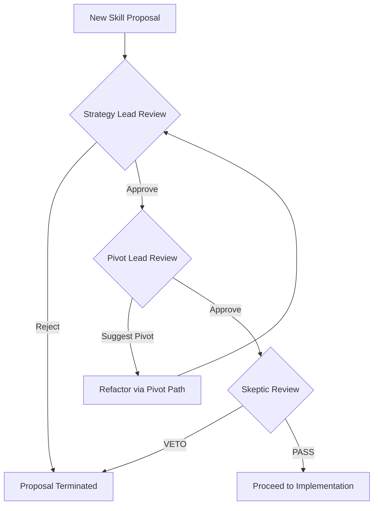

# Implementation: Stratification Review Workflow

## Fast path (MUST)

Routine local edits (one file, no new skill, no DNA change) MUST use this path and MUST NOT run the three-stage sequence:

1. Edit the file.
2. Write a one-line verdict.
3. Stop.

## Overview

The Stratification Review is the governance loop for architecture and new-skill proposals. Fast path (above) has equal force and MUST win for routine edits. Members are manifests, not runtime agents. Each stage MUST write a named artifact (`strategy-record`, `pivot-record`, or `veto-record`). Roleplay without an artifact does not count.

## The Review Sequence

1. **Stage 1: Strategy Lead (Alignment)**
   - **Goal**: Ensure the proposal aligns with the North Star.
   - **Status**: If the Strategy Lead rejects the proposal, the process terminates. If they approve, it proceeds to the Pivot Lead.

2. **Stage 2: Pivot Lead (Leverage)**
   - **Goal**: Optimize for the highest leverage (Value/Complexity).
   - **Status**: If the Pivot Lead identifies a more efficient way to achieve the goal, they suggest a "Pivot." The team may choose to adopt the pivot or proceed with the original plan. If they approve or suggest a pivot, it proceeds to the Skeptic.

3. **Stage 3: Skeptic (Complexity Control)**
   - **Goal**: Prevent bloat and unnecessary architectural depth.
   - **Status**: The Skeptic applies the "Three Lenses" (Necessity, Placement, Depth).
   - **The Veto**: If the Skeptic issues a **VETO**, the proposal is sent back to the beginning for refactoring or total rejection.

## Amendment Protocol (Board Governance)

When a change to a Board Persona or the Governance Workflow itself is proposed, the following checklist must be completed:

### 1. Impact Assessment

- [ ] **North Star Check**: Does this change strengthen or dilute the core mission?
- [ ] **Lens Integrity**: Does this change weaken one of the three lenses (Necessity, Placement, Depth)?
- [ ] **Automation Check**: Can this new rule be operationalized into an existing Core Operation/Skill?

### 2. Regression Strategy

- [ ] **Scenario Test**: Provide the new persona/rule with the existing "Golden Datasets."
- [ ] **Veto Verification**: Ensure the new rule doesn't cause "unjustified vetoes" of valid proposals.

### 3. Traceability

- [ ] **Log Entry**: Write a dated amendment record in the working tree. MUST NOT invent a log file that is not in this snapshot.
- [ ] **Task Link**: Name the operator task or issue. MUST NOT invent a `plan.md` that is not in this snapshot.

## Workflow Logic (Pseudocode)

## Governance Rules

- **Fast path supremacy**: Routine local edits MUST skip this sequence.
- **Mandatory Sequence**: An architecture proposal cannot skip a stage.
- **Veto Supremacy**: A Skeptic veto-record is final for the current version of the proposal.
- **Documentation**: Each review MUST be a named artifact in the working tree, not a persona monologue.
