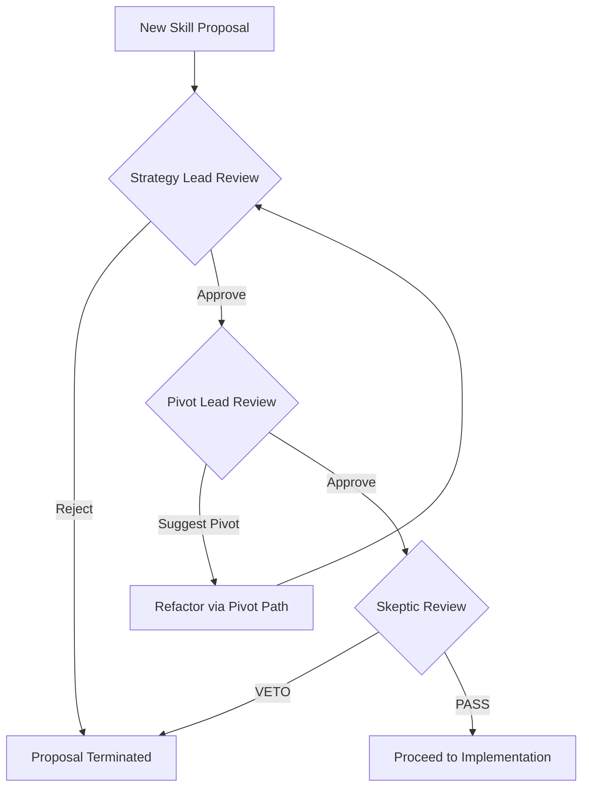

# Implementation: Stratification Review Workflow

## Overview

The Stratification Review is the mandatory governance loop for all Skill-Generator proposals. Every proposal must pass through the three board members in a specific sequence to ensure strategic alignment, efficient implementation, and minimal complexity.

## The Review Sequence

1. **Stage 1: Strategy Lead (Alignment)**
   - **Goal**: Ensure the proposal aligns with the North Star.
   - **Status**: If the Strategy Lead rejects the proposal, the process terminates. If they approve, it proceeds to the Pivot Lead.

2. **Stage 2: Pivot Lead (Leverage)**
   - **Goal**: Optimize for the highest leverage (Value/Complexity).
   - **Status**: If the Pivot Lead identifies a more efficient way to achieve the goal, they suggest a "Pivot." The team may choose to adopt the pivot or proceed with the original plan. If they approve or suggest a pivot, it proceeds to the Skeptic.

3. **Stage 3: Skeptic (Complexity Control)**
   - **Goal**: Prevent bloat and unnecessary architectural depth.
   - **Status**: The Skeptic applies the "Three Lenses" (Necessity, Placement, Depth).
   - **The Veto**: If the Skeptic issues a **VETO**, the proposal is sent back to the beginning for refactoring or total rejection.

## Amendment Protocol (Board Governance)

When a change to a Board Persona or the Governance Workflow itself is proposed, the following checklist must be completed:

### 1. Impact Assessment

- [ ] **North Star Check**: Does this change strengthen or dilute the core mission?
- [ ] **Lens Integrity**: Does this change weaken one of the three lenses (Necessity, Placement, Depth)?
- [ ] **Automation Check**: Can this new rule be operationalized into an existing Core Operation/Skill?

### 2. Regression Strategy

- [ ] **Scenario Test**: Provide the new persona/rule with the existing "Golden Datasets."
- [ ] **Veto Verification**: Ensure the new rule doesn't cause "unjustified vetoes" of valid proposals.

### 3. Traceability

- [ ] **Log Entry**: Record the amendment in `governance_log.md`.
- [ ] **Task Link**: Link the amendment to its corresponding task in `plan.md`.

## Workflow Logic (Pseudocode)

## Governance Rules

- **Mandatory Sequence**: A proposal cannot skip a stage.
- **Veto Supremacy**: A Skeptic's Veto is final for the current version of the proposal.
- **Documentation**: Each review must be documented in the project's `governance_log.md` or similar audit trail.
